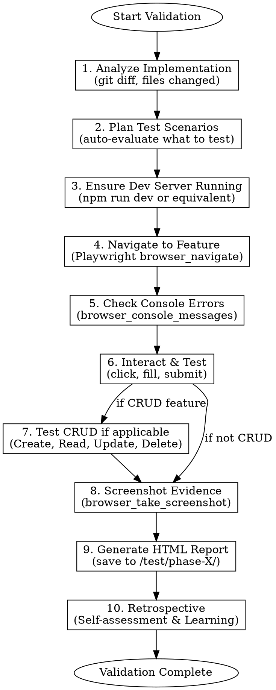

# Feature Validation

## 🚨 CRITICAL BLOCKERS - READ FIRST

**This skill has TWO mandatory file reads that CANNOT be skipped:**

1. **Phase 1 BLOCKER:** You MUST read the session transcript from `C:\Users\pauol\.claude\projects\G---OneDrive-OneDrive-Desktop\{session_id}.jsonl` to identify the trigger message. Find the most recent `.jsonl` file and document the user message that invoked this skill.

2. **Phase 10 BLOCKER:** You MUST re-read the session transcript to perform an evidence-based retrospective. Cite specific line numbers. In-context memory is NOT sufficient.

**Session transcript location:** `C:\Users\pauol\.claude\projects\G---OneDrive-OneDrive-Desktop\`

**If you cannot read the transcript:** STOP and inform the user. Do not proceed with memory-based retrospective.

---

## Overview

**Feature validation is REAL testing, not documentation screenshots.** This skill ensures implemented features are tested by actually navigating to the app, interacting with elements, checking console errors, and validating functionality works as intended.

**Core principle:** If you didn't interact with the real feature in the real app, you didn't test it.

## When to Use

- After completing a feature implementation phase
- After fixing bugs that need verification
- After any CRUD-related changes
- When user requests validation of recent work
- Before marking any implementation as "complete"

**Do NOT use for:**
- Unit test writing (use test-driven-development skill)
- Code review (use code-reviewer agents)
- Planning phases (use writing-plans skill)

## The Validation Workflow



## Phase 1: Analyze Implementation

**Determine what was implemented:**

```bash
# Check recent changes
git diff --name-only HEAD~5
git log --oneline -5

# Or for staged changes
git diff --cached --name-only
```

**🚨 MANDATORY: Identify Trigger Context from Session Transcript**

You MUST read the actual session transcript file to identify the trigger message. This is NOT optional.

**Step 1: Find the current session file**
```
Glob: pattern="*.jsonl" path="C:\Users\pauol\.claude\projects\G---OneDrive-OneDrive-Desktop"
```
Select the most recently modified `.jsonl` file (this is the current session).

**Step 2: Check file size FIRST**
```bash
# Check file size before reading
ls -lh "C:\Users\pauol\.claude\projects\G---OneDrive-OneDrive-Desktop\{session_id}.jsonl"
```

Or use Bash to get size in bytes:
```bash
stat --format=%s "{session_file}" 2>/dev/null || wc -c < "{session_file}"
```

**Step 3: Choose the right tool based on file size**

| File Size | Tool to Use | Why |
|-----------|-------------|-----|
| < 256KB | `Read` tool directly | Small enough to read whole file |
| > 256KB | `Grep` first, then `Read` specific lines | Too large for direct read |

**If file is SMALL (< 256KB):**
```
Read: file_path=".../{session_id}.jsonl"
```

**If file is LARGE (> 256KB):**
```
Grep: pattern="feature-validation" path=".../{session_id}.jsonl" output_mode="content" -n=true
```
Then read the specific line range around the trigger:
```
Read: file_path=".../{session_id}.jsonl" offset={trigger_line - 5} limit=10
```

**Step 4: Find the trigger message**
Search the transcript for the message where `/feature-validation` was invoked. Look for:
- User message containing `/feature-validation` or similar skill invocation
- The context around that message (what was the user asking for?)
- Note the approximate line number or message index

**Step 5: Document the trigger**
```
TRIGGER CONTEXT:
- Session ID: {session_id}
- Trigger line/index: ~{line_number}
- User request: "{exact or summarized user message}"
- Context: {what work preceded this validation request}
```

**Store this information - you WILL need it in Phase 10.**

**Categorize changes:**
- **UI Components** - Need visual validation + interaction tests
- **CRUD Operations** - Need full create/read/update/delete cycle tests
- **API Integrations** - Need data flow validation
- **Forms** - Need input validation + submission tests
- **Navigation** - Need route accessibility tests

## Phase 2: Plan Test Scenarios

**Auto-evaluate based on implementation type:**

| Implementation Type | Required Tests |
|---------------------|----------------|
| New page/route | Navigate, render check, console errors |
| Form component | Field interactions, validation, submission |
| List/table component | Data display, pagination, filtering |
| CRUD feature | Create item, verify created, edit, verify edit, delete, verify deleted |
| Modal/dialog | Open, interact, close, state persistence |
| API integration | Data loads, error states, loading states |
| Button/action | Click handler fires, expected result occurs |

**Create test checklist using TodoWrite** - one todo per test scenario.

## Phase 3: Ensure Dev Server Running

**CRITICAL: Tests run against REAL running app, not static files.**

```bash
# Start dev server in background
npm run dev &

# Or check if already running
lsof -i :8900  # Check if port in use
```

**Wait for server ready** - poll until http://localhost:8900 responds.

**If server won't start:** Use Python HTTP server as fallback for static testing:
```bash
cd dist && python3 -m http.server 8900
```

## Phase 4: Navigate to Feature

**Use Playwright MCP tools:**

```
browser_navigate: url="http://localhost:8900/route-to-test"
```

**For protected routes:** Handle authentication first:
1. Navigate to login
2. Fill credentials
3. Submit login
4. Navigate to protected feature

## Phase 5: Check Console Errors

**MANDATORY for every page navigation:**

```
browser_console_messages
```

**Report ANY errors found:**
- JavaScript errors
- Network errors (failed fetches)
- React/Vue warnings
- TypeScript runtime errors

**Console errors are TEST FAILURES** - document and report them.

## Phase 6: Interact & Test

**Use Playwright interaction tools:**

| Action | Tool | Example |
|--------|------|---------|
| Click button | `browser_click` | `selector="button[type='submit']"` |
| Fill input | `browser_fill` | `selector="#email"` `value="test@example.com"` |
| Select option | `browser_select` | `selector="#country"` `value="ES"` |
| Check element exists | `browser_snapshot` | Look for element in accessibility tree |
| Hover | `browser_hover` | `selector=".dropdown-trigger"` |

**Test interaction patterns:**
1. Click/tap → Verify expected response
2. Fill form → Verify validation feedback
3. Submit → Verify success/error handling
4. Navigate → Verify route change

## Phase 7: CRUD Testing (If Applicable)

**Full CRUD cycle is MANDATORY for any data management feature:**

### Create
1. Navigate to create form
2. Fill all fields with test data
3. Submit form
4. **Verify:** Item appears in list/table
5. Screenshot evidence

### Read
1. Navigate to list/detail view
2. **Verify:** Created item is visible
3. **Verify:** Data displays correctly
4. Screenshot evidence

### Update
1. Click edit on created item
2. Modify field values
3. Save changes
4. **Verify:** Changes persist
5. Screenshot evidence

### Delete
1. Click delete on item
2. Confirm deletion (if confirmation dialog)
3. **Verify:** Item no longer in list
4. Screenshot evidence

**Use unique test data** - timestamp or UUID to identify test items:
```
Test Client - ${Date.now()}
```

## Phase 8: Screenshot Evidence

**Screenshot EVERY significant state:**

```
browser_take_screenshot: filename="test-crud-create-form.png"
```

**Required screenshots:**
- Initial state (before interaction)
- After each major action
- Error states (if any occur)
- Final/success state

**Save to project directory:** `.playwright-mcp/` or specified test directory.

## Phase 9: Generate HTML Report

**Create persistent report at `/test/[phase-name]/report.html`:**

```html
<!DOCTYPE html>
<html>
<head>
  <title>Feature Validation Report - [Phase Name]</title>
  <style>
    body { font-family: system-ui; max-width: 1200px; margin: 0 auto; padding: 20px; }
    .pass { color: #22c55e; }
    .fail { color: #ef4444; }
    .warn { color: #f59e0b; }
    .screenshot { max-width: 100%; border: 1px solid #ddd; margin: 10px 0; }
    .test-case { border: 1px solid #e5e7eb; padding: 15px; margin: 10px 0; border-radius: 8px; }
    .console-error { background: #fef2f2; padding: 10px; border-left: 3px solid #ef4444; }
  </style>
</head>
<body>
  <h1>Feature Validation Report</h1>
  <p><strong>Date:</strong> [timestamp]</p>
  <p><strong>Phase:</strong> [phase name]</p>

  <h2>Summary</h2>
  <ul>
    <li>Total Tests: X</li>
    <li class="pass">Passed: Y</li>
    <li class="fail">Failed: Z</li>
    <li class="warn">Warnings: W</li>
  </ul>

  <h2>Test Results</h2>
  <!-- For each test case -->
  <div class="test-case">
    <h3>[Test Name] - <span class="pass/fail">PASS/FAIL</span></h3>
    <p><strong>Description:</strong> [what was tested]</p>
    <p><strong>Steps:</strong></p>
    <ol>
      <li>[step 1]</li>
      <li>[step 2]</li>
    </ol>
    <p><strong>Result:</strong> [outcome]</p>
    
  </div>

  <h2>Console Errors</h2>
  <!-- List any console errors found -->
  <div class="console-error">
    <pre>[error message]</pre>
    <p>Page: [url where error occurred]</p>
  </div>

  <h2>Files Changed</h2>
  <ul>
    <!-- List of files that were tested -->
  </ul>
</body>
</html>
```

**Report location:** Create directory structure:
```
/test/
  phase-1-design-system/
    report.html
    screenshots/
  phase-2-ai-infrastructure/
    report.html
    screenshots/
  phase-3-routine-builder/
    report.html
    screenshots/
```

## Phase 10: Retrospective & Learning

**🚨 MANDATORY: Read Session Transcript for Evidence-Based Retrospective**

You MUST read the actual session transcript to perform a proper retrospective. Do NOT rely on in-context memory alone.

**Step 1: Check file size FIRST (same as Phase 1)**
```bash
ls -lh "C:\Users\pauol\.claude\projects\G---OneDrive-OneDrive-Desktop\{session_id}.jsonl"
```

**Step 2: Choose the right tool based on file size**

| File Size | Tool to Use | Why |
|-----------|-------------|-----|
| < 256KB | `Read` tool directly | Small enough to read whole file |
| > 256KB | `Grep` to find actions, then `Read` specific lines | Too large for direct read |

**If file is SMALL (< 256KB):**
```
Read: file_path="C:\Users\pauol\.claude\projects\G---OneDrive-OneDrive-Desktop\{session_id}.jsonl"
```

**If file is LARGE (> 256KB):**
Use Grep to find your tool calls and actions:
```
Grep: pattern="mcp__playwright|browser_navigate|TodoWrite" path=".../{session_id}.jsonl" -n=true
```
Then read specific line ranges around key actions:
```
Read: file_path="..." offset={action_line - 2} limit=5
```

**Step 3: Extract execution evidence**
From the transcript, identify:
- The trigger message (from Phase 1 documentation)
- Each phase you executed (look for tool calls, navigation, screenshots)
- Any errors or warnings encountered
- User corrections or clarifications
- Time between phases (if timestamps available)

**Step 4: Self-Assessment Questions (answer with EVIDENCE from transcript)**

| Question | Evidence Required |
|----------|-------------------|
| Did I stick to the plan? | Quote specific tool calls or actions from transcript |
| Did I catch all errors? | List console errors found vs. errors in final report |
| Was the report comprehensive? | Compare screenshots taken vs. tests documented |
| Did I skip any phases? | Check transcript for each phase marker |
| Did user have to correct me? | Quote any user corrections from transcript |

**Step 5: Structured Reflection with Citations**

Output the following format, citing LINE NUMBERS from the transcript:

```
=== RETROSPECTIVE (Evidence-Based) ===

**Session:** {session_id}
**Trigger:** "{user message}" (line ~{N})
**Phases Executed:** 1-2-3-4-5-6-7-8-9-10

**WHAT I DID:**
- [Action] (transcript line ~{N})
- [Action] (transcript line ~{N})
- ...

**WHAT WENT WELL:**
- [Positive] - Evidence: {quote from transcript}

**WHAT COULD BE IMPROVED:**
- [Issue] - Evidence: {quote from transcript}
- [Suggestion] - This would have: {concrete improvement}

**USER CORRECTIONS RECEIVED:**
- "{correction}" (line ~{N}) - I should have: {lesson}

**SUGGESTIONS FOR NEXT RUN:**
1. [Actionable tip based on THIS session's evidence]
2. [Pattern to avoid based on THIS session's evidence]
```

**Step 6: Validate Completeness**
Before finishing, verify:
- [ ] I read the actual session transcript file (not just in-context memory)
- [ ] I cited specific line numbers or quotes
- [ ] I identified at least one thing that could be improved
- [ ] If user corrected me, I documented the lesson

## Common Mistakes

| Mistake | Correct Approach |
|---------|------------------|
| Screenshot HTML summary page | Screenshot REAL app pages |
| Skip console error check | ALWAYS check `browser_console_messages` |
| Test only happy path | Test error states too |
| Delete test reports | Keep reports persistent in `/test/` |
| Skip CRUD delete step | ALWAYS complete full CRUD cycle |
| Test against static HTML | Test against running dev server |
| Assume feature works | Click it, verify response, screenshot evidence |
| **Skip session transcript read** | **ALWAYS read from `.jsonl` file in Phase 1 and 10** |
| **Use in-context memory for retrospective** | **READ the actual transcript file for evidence** |
| **No citations in retrospective** | **ALWAYS cite line numbers from transcript** |

## Red Flags - STOP and Fix

- "I'll just screenshot my validation summary" → NO, test the REAL feature
- "Console errors are minor" → NO, all errors are failures to document
- "CRUD read is enough" → NO, test full create/update/delete cycle
- "The feature looks correct" → VERIFY with interaction, don't assume
- "I'll clean up test reports later" → NO, reports are PERMANENT
- **"I remember what happened"** → NO, READ the session transcript file
- **"Based on my recollection"** → NO, CITE line numbers from .jsonl file
- **"The retrospective is from memory"** → BLOCKED - must read transcript first

## Quick Reference

**Playwright MCP Essential Tools:**

| Tool | Purpose |
|------|---------|
| `browser_navigate` | Go to URL |
| `browser_click` | Click element |
| `browser_fill` | Type into input |
| `browser_take_screenshot` | Capture evidence |
| `browser_console_messages` | Check for errors |
| `browser_snapshot` | Get page accessibility tree |
| `browser_go_back` | Navigate back |
| `browser_go_forward` | Navigate forward |

**Test Data Patterns:**

```javascript
// Unique identifiers for test data
const testId = Date.now();
const testName = `Test Item ${testId}`;
const testEmail = `test-${testId}@example.com`;
```

## Integration with Other Skills

- **After using:** verification-before-completion (validates claims)
- **Before using:** executing-plans, subagent-driven-development (validate completed work)
- **Complements:** systematic-debugging (when tests find issues)

## Checklist

Use TodoWrite to track each validation step:

- [ ] **🚨 READ session transcript** (find .jsonl in `.claude/projects/`, identify trigger message)
- [ ] **Document trigger context** (session ID, line number, user request)
- [ ] Analyze implementation (git diff, identify changes)
- [ ] Plan test scenarios (categorize, create test list)
- [ ] Start dev server (verify running on correct port)
- [ ] Navigate to feature (Playwright browser_navigate)
- [ ] Check console errors (browser_console_messages)
- [ ] Test interactions (click, fill, submit)
- [ ] Test CRUD cycle (if applicable - full create/read/update/delete)
- [ ] Capture screenshots (every significant state)
- [ ] Generate HTML report (save to /test/[phase]/)
- [ ] Verify report is persistent (not deleted)
- [ ] **🚨 RE-READ session transcript for Phase 10**
- [ ] **Perform Evidence-Based Retrospective** (cite line numbers, quote transcript)
- [ ] **Validate retrospective completeness** (all 4 checkboxes in Phase 10 Step 5)
